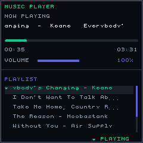

# Rust Music Player

A modern, terminal-based music player built in Rust with a custom framebuffer renderer and real-time audio processing.



## Features

- 🎵 **Multi-format Audio Support**: MP3, FLAC, WAV, OGG, and AAC
- 🎨 **Custom Graphics**: 240x240 framebuffer with RGB565 color display
- 🎛️ **Real-time Audio**: Low-latency audio processing using CPAL and Symphonia
- 🎮 **Keyboard Controls**: Full keyboard navigation and control
- 💾 **State Persistence**: Automatically saves and restores playback state
- 📱 **Modern UI**: Clean, modern interface with progress bars and visual feedback
- 🔄 **Auto-Advance**: Automatically plays next track when current finishes
- 📊 **Volume Control**: Real-time volume adjustment with visual indicator
- 📋 **Playlist Management**: Browse and select tracks from your music library

## Screenshots

The interface displays:
- Current playing track with marquee scrolling for long titles
- Progress bar with elapsed/total time
- Volume control with percentage display
- Interactive playlist with scroll indicators
- Play/pause status indicators

## Installation

### Prerequisites

- Rust (1.70 or later)
- Audio drivers compatible with CPAL

### Building from Source

```bash
git clone <repository-url>
cd rust-music-player
cargo build --release
```

### Running

1. Place your music files in the `songs/` directory
2. Run the application:

```bash
cargo run --release
```

## Usage

### Keyboard Controls

| Key | Action |
|-----|---------|
| `Space` | Toggle Play/Pause |
| `↑/↓` | Navigate playlist up/down |
| `Enter` | Select and play highlighted track |
| `←/→` | Previous/Next track |
| `+/=` | Increase volume |
| `-` | Decrease volume |
| `q` | Quit application |

### Supported Audio Formats

- **MP3** - MPEG Audio Layer 3
- **FLAC** - Free Lossless Audio Codec
- **WAV** - Waveform Audio File Format
- **OGG** - Ogg Vorbis
- **AAC** - Advanced Audio Codec

## Project Structure

```
rust-music-player/
├── src/
│   ├── main.rs                 # Main application and threading
│   ├── playlist.rs             # Playlist management
│   ├── state.rs               # State persistence
│   ├── audio/
│   │   ├── mod.rs             # Audio module exports
│   │   ├── control.rs         # Audio control and synchronization
│   │   ├── decoder.rs         # Audio decoding with Symphonia
│   │   ├── device.rs          # Audio device management
│   │   ├── engine.rs          # Audio engine and output
│   │   └── resampler.rs       # Sample rate conversion
│   └── display/
│       ├── mod.rs             # Display module exports
│       ├── framebuffer.rs     # RGB565 framebuffer implementation
│       ├── render.rs          # UI rendering and drawing
│       ├── state.rs           # Display state management
│       ├── font.rs            # Bitmap font definitions
│       └── text.rs            # Text rendering
├── songs/                     # Music files directory
├── Cargo.toml                 # Dependencies and project config
├── display.png               # Current UI screenshot
└── frame.png                 # Rendered frame output
```

## Technical Details

### Architecture

The application uses a multi-threaded architecture:

- **Main Thread**: Coordinates other threads and handles application lifecycle
- **Audio Decoder Thread**: Decodes audio files and feeds samples to the audio buffer
- **Audio Output Thread**: Manages real-time audio output using CPAL
- **Display Thread**: Renders UI at 30 FPS to framebuffer and saves as PNG
- **Input Thread**: Handles keyboard input using Crossterm
- **Auto-save Thread**: Periodically saves application state

### Audio Processing

- **Decoder**: Uses Symphonia library for format-agnostic audio decoding
- **Resampling**: Converts audio to device sample rate for consistent playback
- **Buffering**: Ring buffer implementation for smooth, glitch-free audio
- **Control**: Atomic operations for thread-safe volume and playback control

### Display System

- **Framebuffer**: Custom 240x240 RGB565 framebuffer
- **Rendering**: Software rendering with primitive drawing functions
- **Text**: Custom bitmap font rendering with 7x8 character size
- **Colors**: Carefully chosen color palette for modern appearance
- **Animation**: Smooth progress bars and marquee text scrolling

## Dependencies

| Crate | Version | Purpose |
|-------|---------|---------|
| `symphonia` | 0.5.5 | Audio format decoding |
| `cpal` | 0.17.3 | Cross-platform audio I/O |
| `ringbuf` | 0.4.8 | Lock-free audio buffer |
| `crossterm` | 0.29.0 | Cross-platform terminal API |
| `ratatui` | 0.30.0 | Terminal UI framework |
| `image` | 0.25.10 | Image processing and PNG output |
| `serde` | 1.0.228 | Serialization for state persistence |
| `anyhow` | 1.0.102 | Error handling |

## State Management

The application automatically saves:
- Currently playing track
- Playback position
- Volume level
- Playlist position

State is persisted to `state.json` and restored on startup.

## Development

### Building Debug Version

```bash
cargo build
```

### Running Tests

```bash
cargo test
```

### Code Structure

The codebase is organized into distinct modules:
- **Audio**: All audio-related functionality
- **Display**: UI rendering and framebuffer management  
- **Playlist**: Music library management
- **State**: Persistence and configuration

## License

This project is open source. See LICENSE file for details.

## Contributing

Contributions are welcome! Please feel free to submit issues and pull requests.

## Acknowledgments

- [Symphonia](https://github.com/pdeljanov/Symphonia) - Excellent audio decoding library
- [CPAL](https://github.com/RustAudio/cpal) - Cross-platform audio library
- Rust audio community for inspiration and guidance
